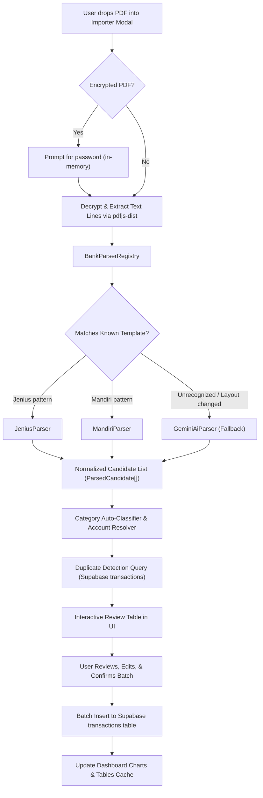

# Bank Statement PDF Importer Design Specification

- **Date**: 2026-10-01
- **Status**: Approved Design
- **Target Repo**: `financial-tracker-dashboard`
- **Related Project**: `supabase-telegram-webhook`

---

## 1. Executive Summary

This feature adds a client-side Bank Statement PDF Importer directly to `financial-tracker-dashboard`. Users can upload e-statement PDFs (such as Bank Mandiri and Jenius) by dragging and dropping them into the dashboard. The application decrypts password-protected statements locally in browser memory, extracts line items, infers categories, flags potential duplicates against existing database records, and presents an interactive review table where users can approve, edit, or reject transactions before batch-importing them into Supabase.

---

## 2. Architecture & Data Flow

### 2.1 System Architecture



### 2.2 Security & Privacy Guarantees
- **Local Decryption & Parsing**: PDF files and raw byte streams never leave the client browser. All parsing occurs via `pdfjs-dist` in web workers or main thread memory.
- **In-Memory Password Handling**: PDF passwords are kept only in temporary component state during decryption and are immediately discarded. Passwords are never persisted to `localStorage`, session storage, cookies, or sent to any server.
- **Direct Supabase Mutation**: Confirmed transactions are written directly to the existing `transactions` table under the authenticated user's session without requiring intermediate staging tables.

---

## 3. Data Contracts & Interfaces

### 3.1 Parsed Candidate Transaction
```typescript
export interface ParsedCandidate {
  tempId: string;
  occurred_at: string;        // ISO 8601 string (UTC)
  date_raw: string;           // E.g. "15 Sep 2026"
  description: string;        // Cleaned transaction narration
  amount: number;             // Positive number (nominal)
  type: 'income' | 'outcome';
  suggestedCategoryName: string;
  categoryId: string | null;  // Resolved Supabase category UUID
  targetAccountId: string | null; // Resolved Supabase account UUID
  isDuplicate: boolean;
  duplicateReason?: string;
  selected: boolean;          // Selection checkbox state
  rawLine?: string;           // Debug / trace line
}
```

### 3.2 Bank Parser Adapter Interface
```typescript
export interface BankParser {
  name: string;
  canHandle(rawText: string): boolean;
  parse(rawText: string, options?: { defaultYear?: number }): ParsedCandidate[];
}
```

---

## 4. Parser Adapters

### 4.1 Mandiri Parser (`mandiriParser.ts`)
- **Detection**: Matches `Nominal (IDR) ... Saldo (IDR)` or `Amount (IDR) ... Balance (IDR)`.
- **Date & Time**: Extracts date in `DD MMM YYYY` format and joins optional continuation line containing `HH:mm:ss WIB` to produce precise UTC timestamps.
- **Sign & Nominal**: Negative amounts (prefixed with `-`) become `outcome`; positive/unsigned amounts become `income`.
- **Narration Cleaning**: Removes bank header/footer boilerplate, disclaimers (*"Nasabah tunduk dan terikat..."*), and deduplicates repeated reference numbers.

### 4.2 Jenius Parser (`jeniusParser.ts`)
- **Detection**: Matches date prefixes (`DD/MM/YYYY` or `DD Mon`) alongside trailing signed currency format.
- **Filtering**: Ignores account holder name lines (`Angga Radifan Sumarna`), balance inquiries, and period header rows.
- **Sign & Nominal**: Negative amounts (prefixed with `-`) become `outcome`; unsigned amounts become `income`.

### 4.3 AI Fallback Parser (`geminiAiParser.ts`)
- **Trigger**: Activated when an uploaded statement does not match any known template or when the user explicitly clicks "Analyze with AI".
- **Implementation**: Uses Gemini 2.0/1.5 Flash via `@google/genai` (or fetch call using user-configured VITE Gemini API key) with structured output schema requesting `{ transactions: Array<{ date, description, amount, type }> }`.

---

## 5. Category & Account Resolution

### 5.1 Category Auto-Tagger
Uses keyword regex dictionary matching against the cleaned description:
- **Bills**: `cloudflare|google|pln|pdam|indihome|telkom|netflix|spotify|subscription|tagihan|bill`
- **Food**: `nasi|jco|marugame|udon|solaria|coffee|kopi|cafe|restaurant|resto|food|makan|ayam|bakmi|burger|pizza`
- **Transport**: `gojek|grab|taxi|bluebird|mrt|krl|kereta|tol|parking|parkir|shell|pertamina|bp`
- **Shopping**: `tokopedia|shopee|lazada|blibli|bukalapak|tiktok shop|zalora|uniqlo|ikea`
- **Transfer**: `transfer|bi fast|ke bank|top up|topup|gopay|ovo|dana`
- **Fees**: `biaya administrasi|admin fee|service fee`
- **Health**: `apotek|pharmacy|doctor|dokter|clinic|klinik|hospital|halodoc`
- **Entertainment**: `cinema|bioskop|xxi|cgv|steam|playstation`
- **Travel**: `hotel|flight|tiket|booking|airbnb|agoda|traveloka`

If an inferred category matches an existing user category in Supabase, `categoryId` is pre-populated. Otherwise, it defaults to the user's "Uncategorized" category or remains unselected for user assignment.

### 5.2 Account Linking
- Automatically identifies bank account name from statement metadata (e.g., "Mandiri", "Jenius").
- Case-insensitively checks the active user's accounts list loaded in React context.
- Allows global account override in the review toolbar to switch the target account for all rows in a single click.

---

## 6. Duplicate Detection Logic

Before displaying candidates in the review table, the dashboard queries existing database records:
```typescript
const { data: existingTransactions } = await supabase
  .from('transactions')
  .select('id, occurred_at, amount, type, description, account_id')
  .gte('occurred_at', minDateIso)
  .lte('occurred_at', maxDateIso)
  .eq('account_id', targetAccountId)
  .is('deleted_at', null);
```

A candidate is flagged as duplicate (`isDuplicate = true`) when:
1. `amount` and `type` match exactly.
2. `occurred_at` falls within ±1 day (to account for settlement vs. posting date variations).
3. The row's `selected` flag is set to `false` by default, with a warning badge displayed in the UI.

---

## 7. User Interface Components

### 7.1 Location & Entry Point
- In [`src/components/TransactionTable`](file:///C:/Users/Angga/Documents/Works/Test/financial-tracker-dashboard/src/components/TransactionTable), add an **"Import Statement"** button in the actions toolbar next to "Add Transaction".

### 7.2 Component Tree
- `src/components/BankStatementImporter/`
  - `BankStatementModal.tsx`: Modal container, workflow step manager.
  - `PdfDropzone.tsx`: Drag-and-drop file receiver with format validation.
  - `PasswordPromptModal.tsx`: Inline modal / prompt when PDF is password-protected.
  - `StatementReviewTable.tsx`: Full-featured candidate review table with filters, inline category pickers, and duplicate badges.
  - `ImportSummaryBar.tsx`: KPI counter (Total rows, New, Suspected duplicates, Total Outcome, Total Income).

---

## 8. Error Handling & Edge Cases

| Condition | User Experience & Recovery |
| :--- | :--- |
| **Password Protected PDF** | Modal intercepts `PasswordException`, presents secure password input. Clears password on cancel or success. |
| **Incorrect Password** | Retains file in memory, shakes password input, shows *"Incorrect password. Please try again."* |
| **Unsupported Bank Format** | Shows template mismatch notice, offers one-click *"Parse with AI"* fallback. |
| **Zero Rows Extracted** | Helpful empty state with suggestions to check date range or run AI parser. |
| **Database Batch Insert Failure** | Displays error toast with exact failure reason, retains review table state and user edits so user can retry without re-parsing. |

---

## 9. Testing Strategy

1. **Unit Tests (Vitest)**:
   - `mandiriParser.test.ts`: Verify Mandiri PDF extracted text parses dates, joins multi-line remarks, identifies WIB time, and signs amounts correctly.
   - `jeniusParser.test.ts`: Verify Jenius text parses dates, ignores account holder names, and formats outcome amounts.
   - `categoryClassifier.test.ts`: Test keyword rules and fallback logic.
   - `duplicateDetector.test.ts`: Test matching heuristics with mock date drift.
2. **Component & Integration Tests**:
   - Test `BankStatementModal` rendering, drag-and-drop state, and password prompt flow.
   - Test `StatementReviewTable` select-all/deselect toggles, inline category edits, and batch insert triggering.
